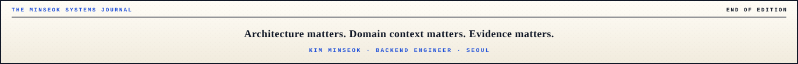

  

  
  
  

  

<h3 align="center">Building reliable enterprise software — and the systems that make AI reliable inside it.</h3>

  HR 도메인과 레거시 엔터프라이즈 시스템을 깊이 이해하고, 
  AI가 <b>근거·규칙·안전장치</b> 안에서 일하도록 설계하는 백엔드 엔지니어입니다.

 

## 🧭 What I Do

- **Enterprise Backend & Modernization** — Java/Spring 기반 레거시 분석, 성능 개선, 클라우드·플랫폼 이관
- **HR Domain Engineering** — 인사·조직·급여·근태·성과·복리후생 업무 규칙을 시스템으로 구현
- **AI / AX Engineering** — Skills, Agents, Hooks, Guardrails를 결합해 AI가 실제 코드베이스에서 안전하게 일할 환경 설계
- **Technical Leadership** — 고객 협의, 파트 리딩, 팀원 교육, AI 파일럿에서 조직 확산까지 실행

  
  
  
  

---

## 🛠️ Engineering Stack

  

  
  
  
  
  
  

---

## 📊 GitHub Activity

  

  

 

 

  

